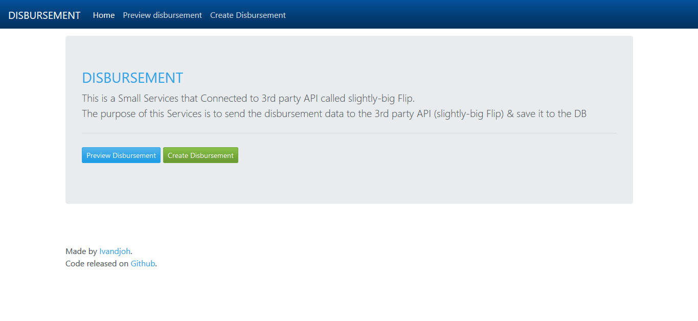
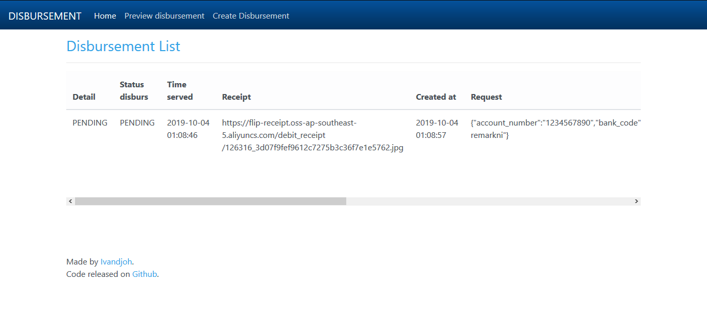
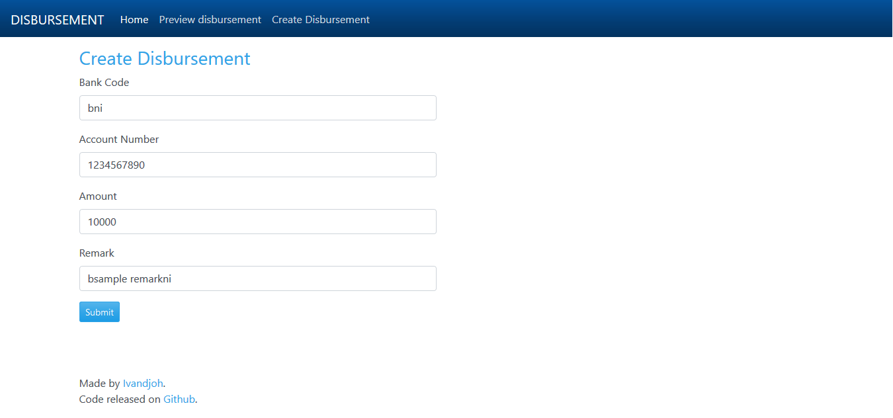

## Disbursement Services

### About Disbursement Services
This is a Small Services that Connected to 3rd party is called slightly-big Flip.
The purpose of this Services is to  send the disbursement data to the 3rd party API (slightly-big Flip)
and then Save the detailed data about the disbursement from the 3rd party response in the local database

    1.  This Services was developed using MVC pattern and OOP concept and it wasn't use any Framework.
    2.  This Services already been included with Regular expressions, Router & Handling databases with PDO.

Like the most MVC frameworks, in this Disbursement Services Project, i use the flows through public/index.php and loads the correspondant page base on the URL.
Here is the Project Structure :

    disburs/
        config/             # Database credentials, utility functions, constants used frequently
        data/               # SQL database file
        public/             # Accessible files. What final users see
            css/            # Compiled css file
            js/             # Compiled javascript file
            index.php       # Starting point for the entire app
        src/                # Application source code
            app/            # Router class, routes.php
            controllers/    # Controller classes
            models/         # Model classes
            views/          # Views
            .htaccess       # Make src/ unaccessible for users
        vendor/             # Composer files, autoloader !ignored
        .gitignore          # Files/folders to be ignored by version control
        .htaccess           # Redirect everything to public/ folder
        composer.json       # Composer dependency file

### Getting Started
Before run this Disbursement Services Project, make sure you've some requirements like below :

    1.  Composer (https://getcomposer.org/download/).
    2.  Apache or Nginx for the Web server.
    3.  PHP 7.x or Higher
    4.  MySQL for the Database

For the Installation Process, please follow these inctructions :

    1.  Download as .zip or clone this repo using git clone https://github.com/ivandi1980/disburs.git.
    2.  Import the data/disburs_db.sql file to phpMyAdmin or any Mysql Tools.
    3.  Run composer install (Must!!)
    4.  Start your Apache/Nginx server and go to http://localhost/public
        in my computer i use these command :

            php.exe -S localhost:80 -t B:\SERVERS\disburs

### ScreenShoots

Cause of this services wasn't use any frameworks like Slim, Lumen, etc perhaps it still have any bugs and still far from perfection but i already tried to developed it with clean code and every changelog that was made by me can be seen it on my github commited.

Best Regards, 
Ivandjoh